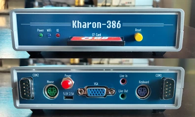
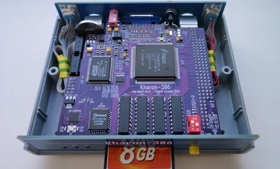
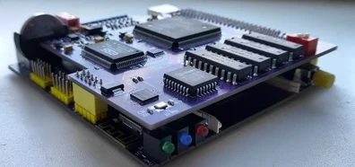

## Kharon-386
10x10cm 386-compatible PC with integrated VGA and sound.

More random photos: [link](https://cloud.err200.net/index.php/s/73TR85tYZkMm8Ax?path=%2Fkharon-386)

### Tech specs
* 386SX40 CPU and M1217B chipset integrated into one M6117D chip
* 4MB RAM
* TVGA9000i VGA video
* ES1868F SoundBlasterPro-compatible sound
* SAM2695 MIDI synthesizer
* ESP8266 WiFi module
* PS/2 keyboard and mouse inputs
* 2xCOM ports
* CF card slot
* Real-time clock (RTC) with backup battery
* Integrated PC-speaker
* 5.1V microUSB power
* Two 4-layer 10x10cm PCBs optimized for G738 and G706 cases

### Navigation
[release/pcb_main.rev.A1.pdf](release/pcb_main.rev.A1.pdf?raw=true) - motherboard schematic and bill of materials  
[release/pcb_top.rev.A1.pdf](release/pcb_top.rev.A1.pdf?raw=true) - video&sound board schematic and bill of materials  
[release/bom_interactive_main.rev.A1.html](https://htmlpreview.github.io/?https://github.com/UzixLS/pc-kharon-386/tree/master/release/bom_interactive_main.rev.A1.html) - motherboard interactive BOM  
[release/bom_interactive_top.rev.A1.html](https://htmlpreview.github.io/?https://github.com/UzixLS/pc-kharon-386/tree/master/release/bom_interactive_top.rev.A1.html) - video&sound board interactive BOM  
[release/gerber_main.rev.A1.zip](release/gerber_main.rev.A1.zip) - motherboard fabrication files  
[release/gerber_top.rev.A1.zip](release/gerber_top.rev.A1.zip) - video&sound board fabrication files  
[release/gerber_covers.rev.A.zip](release/gerber_covers.rev.A.zip) - front and back panel fabrication files  
[roms/M6117 - award+ami.bin](roms/M6117%20-%20award+ami.bin) - main BIOS image  
[roms/tvga9000i - D3.51 + D4.01E.bin](roms/tvga9000i%20-%20D3.51%20%2B%20D4.01E.bin) - VGA BIOS image  
[software/msdos622_compactflash_2GB.7z](software/msdos622_compactflash_2GB.7z) - CF card image with preinstalled MS-DOS 6.22 and all necessary drivers

### WiFi module
There is two options how to use WiFi module:
1. Zimodem ([link](https://github.com/bozimmerman/Zimodem)) - provides ability to connect to BBS via any terminal without using additional software. WiFi module is connected to COM4, so you can use any terminal to communicate with it using AT commands.
2. esp_slip_router ([link](https://github.com/martin-ger/esp_slip_router)) - provides ability to connect your machine to IP network just like as Ethernet. You need ETHERSLIP or similar packet driver for DOS.

To upload firmware you need USB-UART adapter with 3.3V signal levels. Connect GND, RX and TX lines to esp header located on main PCB at left, install BOOT/GND jumper and follow any ESP8266 firmware update guide that is available on the internet.

### Sound mixer
MIDI synthesizer is connected to the AUXB sound input of ES1868F. Usually this input named as "CD input" in mixer software.  
PC speaker is connected to the AUXA input.  
To obtain a minimum noise level, it is recommended to disable line input in the mixer.

### Changelog & current status
Main PCB:
* Rev.A - first release. Please note the [errata](pcb_main/rev.A/ERRATA.txt)
* Rev.A1 - fixed all rev.A issues; added switch for BIOS variant select; added optional -5V source. This revision hasn't been tested.

Top PCB:
* Rev.A - first release. Please note the [errata](pcb_top/rev.A/ERRATA.txt);
* Rev.A1 - fixed all rev.A issues; added switch for VGA BIOS variant select; removed VGA-disable switch; added EEPROM for ES1868. This revision hasn't been tested.

Covers PCB:
* Rev.A - first release.

### Related projects
I want to express my appreciation to the authors of the following projects, which served as inspiration and as reference for my development:

[http://www.alexandrugroza.ro/microelectronics/system-design/isa-80386dx-sbmc/index.html](http://www.alexandrugroza.ro/microelectronics/system-design/isa-80386dx-sbmc/index.html) - 80386DX ISA single board microcomputer by Alexandru Groza  
[https://bitbucket.org/Haper/poisk-2-mainboard/src/master/](https://bitbucket.org/Haper/poisk-2-mainboard/src/master/) - XT compatible 8086-based machine, reverse engineered by Andrew Khapoknysh ([details](https://habr.com/ru/articles/407265/))  
[http://www.malinov.com/Home/sergeys-projects/xi-8088](http://www.malinov.com/Home/sergeys-projects/xi-8088) - IBM PC/XT compatible processor board in ISA board form factor by by Sergey Kiselev  
[https://github.com/skiselev/micro_8088](https://github.com/skiselev/micro_8088) - IBM XT compatible processor board based on Faraday FE2010 chipset by Sergey Kiselev  
[https://github.com/monotech/NuXT](https://github.com/monotech/NuXT) -  MicroATX Turbo XT Motherboard, with VGA, floppy, CF, serial by Monotech  
[http://www.malinov.com/Home/sergeys-projects/isa-supervga](http://www.malinov.com/Home/sergeys-projects/isa-supervga) - ISA Super VGA card based on the Trident TVGA9000i Super VGA controller IC by Sergey Kiselev  
[https://github.com/monotech/PC104-SVGA](https://github.com/monotech/PC104-SVGA) - 8088-compatible 8-bit ISA PC/104 SVGA card by Monotech
[https://github.com/hkzlab/ES1868_ISA8](https://github.com/hkzlab/ES1868_ISA8) - ISA 8bit sound card based on the ES1868F sound chip by hkzlab
