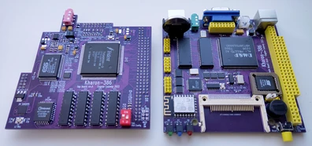

## Kharon-386
10x10cm 386-compatible PC with integrated VGA and sound.

More random photos: [link](https://cloud.err200.net/index.php/s/73TR85tYZkMm8Ax?path=%2Fkharon-386)

### Tech specs
* 386SX40 CPU and M1217B chipset integrated into one M6117D chip
* 4MB RAM
* TVGA9000i VGA video
* ES1868F SoundBlasterPro-compatible sound
* SAM2695 MIDI synthesizer
* ESP8266 WiFi module
* PS/2 keyboard and mouse inputs
* 2xCOM ports
* CF card slot
* Real-time clock (RTC) with backup battery
* Integrated PC-speaker
* 5.1V microUSB power
* Two 4-layer 10x10cm PCBs optimized for G738 and G706 cases

### WiFi module
There is two options how to use WiFi module:
1. Zimodem ([link](https://github.com/bozimmerman/Zimodem)) - provides ability to connect to BBS via any terminal without using additional software. WiFi module is connected to COM4, so you can use any terminal to communicate with it using AT commands.
2. esp_slip_router ([link](https://github.com/martin-ger/esp_slip_router)) - provides ability to connect your machine to IP network just like as Ethernet. You need ETHERSLIP or similar packet driver for DOS.

To upload firmware you need USB-UART adapter with 3.3V signal levels. Connect GND, RX and TX lines to esp header located on main PCB at left, install BOOT/GND jumper and follow any ESP8266 firmware update guide that is available on the internet.

### Sound mixer
MIDI synthesizer is connected to the AUXB sound input of ES1868F. Usually this input named as "CD input" in mixer software.
PC speaker is connected to the AUXA input.

### CF card image
You can found CF card image with preinstalled MS-DOS 6.22 and all required drivers at this link: [link](https://cloud.err200.net/s/t7w4bx3xStSmnJw)

### Changelog & current status
Main PCB:
* Rev.A - first release. Please note the [errata](pcb_main/rev.A/ERRATA.txt)
* Rev.A1 - fixed all rev.A issues; added switch for BIOS variant select; added optional -5V source. This revision hasn't been tested.

Top PCB:
* Rev.A - first release. Please note the [errata](pcb_top/rev.A/ERRATA.txt);
* Rev.A1 - fixed all rev.A issues; added switch for VGA BIOS variant select; removed VGA-disable switch; added EEPROM for ES1868. This revision hasn't been tested.
